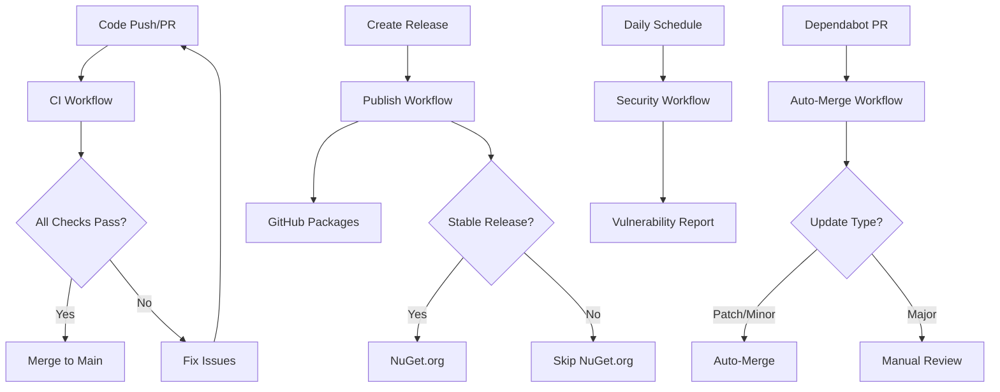

# GitHub Actions Workflows

This directory contains the GitHub Actions workflows for the SchemaGen project. These workflows implement a comprehensive CI/CD pipeline with automated testing, security scanning, and package publishing.

## Workflows Overview

### 🔄 Continuous Integration (`ci.yml`)

**Triggers:** Push to main/develop, Pull Requests
**Purpose:** Validates code quality, runs tests, and creates packages

**Features:**
- **Multi-OS Testing**: Runs on Ubuntu, Windows, and macOS
- **Multi-.NET Testing**: Tests against .NET 8.0, 9.0, and 10.0
- **Comprehensive Testing**: Unit tests with code coverage
- **Package Validation**: Validates NuGet packages using Microsoft tools
- **Security Scanning**: Checks for vulnerable dependencies
- **Code Quality**: Format checking and static analysis
- **Artifact Publishing**: Uploads packages for download

**Matrix Strategy:**
```yaml
strategy:
  matrix:
    os: [ubuntu-latest, windows-latest, macos-latest]
    dotnet-version: ['8.0.x', '9.0.x', '10.0.x']
```

### 📦 Package Publishing (`publish.yml`)

**Triggers:** GitHub Releases, Manual Dispatch
**Purpose:** Publishes packages to GitHub Packages and NuGet.org

**Features:**
- **Automated Publishing**: Publishes on release creation
- **Dual Registry Support**: GitHub Packages (all releases) + NuGet.org (stable only)
- **Symbol Packages**: Publishes debugging symbols (.snupkg)
- **Release Artifacts**: Attaches packages to GitHub releases
- **Manual Triggers**: Supports manual publishing with version input

**Publishing Strategy:**
- **GitHub Packages**: All releases (including prereleases)
- **NuGet.org**: Stable releases only (non-prerelease)

### 🔒 Security & Quality (`security.yml`)

**Triggers:** Push, Pull Requests, Daily Schedule (2 AM UTC)
**Purpose:** Comprehensive security and quality analysis

**Features:**
- **Vulnerability Scanning**: Daily checks for vulnerable packages
- **License Compliance**: Validates package licenses
- **Supply Chain Security**: Generates Software Bill of Materials (SBOM)
- **Code Quality Analysis**: Static analysis and formatting checks
- **Automated Reports**: Uploads security and license reports

### 🤖 Dependabot Auto-Merge (`dependabot-auto-merge.yml`)

**Triggers:** Dependabot Pull Requests
**Purpose:** Automates dependency updates

**Features:**
- **Auto-Merge**: Automatically merges patch and minor updates
- **Manual Review**: Flags major updates for manual review
- **Smart Grouping**: Groups related dependency updates

## Configuration Files

### 📋 Dependabot Configuration (`dependabot.yml`)

Configures automated dependency updates:

- **NuGet Packages**: Weekly updates on Mondays
- **GitHub Actions**: Weekly updates on Mondays
- **Smart Grouping**: Groups related packages (EF Core, Extensions, Testing)
- **Version Policies**: Auto-merge minor/patch, manual review for major

**Package Groups:**
- `entity-framework`: All EF Core packages
- `microsoft-extensions`: Microsoft.Extensions.* packages
- `testing`: Test framework packages
- `analyzers`: Code analysis packages

## Secrets Required

### GitHub Packages
- `GITHUB_TOKEN`: Automatically provided by GitHub Actions

### NuGet.org (Optional)
- `NUGET_API_KEY`: API key for publishing to NuGet.org

## Environment Setup

### Production Environment
- Required for publishing workflows
- Protects against accidental releases
- Requires manual approval for sensitive operations

### Branch Protection
Recommended branch protection rules:
- Require status checks to pass
- Require up-to-date branches
- Require review from code owners
- Restrict pushes to main branch

## Workflow Dependencies



## Package Validation

All packages undergo comprehensive validation:

1. **Build Validation**: Multi-target framework builds
2. **Test Validation**: Unit and integration tests
3. **Package Structure**: NuGet package validation tools
4. **Security Validation**: Vulnerability and license checks
5. **Quality Validation**: Code formatting and static analysis

## Monitoring and Alerts

- **Failed Builds**: GitHub notifications for workflow failures
- **Security Issues**: Daily vulnerability reports
- **Dependency Updates**: Automated PR creation and merging
- **Release Status**: Artifact uploads and release attachments

## Troubleshooting

### Common Issues

1. **Build Failures**: Check multi-targeting compatibility
2. **Test Failures**: Verify test isolation and dependencies
3. **Package Validation**: Ensure proper metadata and structure
4. **Publishing Failures**: Verify secrets and permissions

### Debug Steps

1. Check workflow logs in GitHub Actions tab
2. Review artifact uploads for package contents
3. Validate local builds match CI environment
4. Test package installation from published sources

## Best Practices

1. **Version Management**: Use semantic versioning
2. **Release Notes**: Include comprehensive release notes
3. **Testing**: Maintain high test coverage
4. **Security**: Regular dependency updates
5. **Documentation**: Keep workflows and README updated