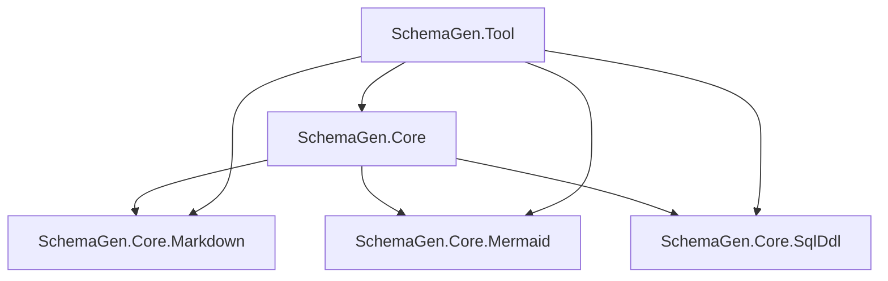
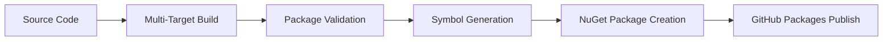

# Design Document: SchemaGen Extraction and Restructuring

## Overview

This design outlines the extraction of SchemaGen projects from the existing `Teez-Technologies/b2c-backend` solution and their restructuring into a standalone NuGet package repository. The solution will follow modern .NET best practices including central package management, multi-targeting, deterministic builds, and automated CI/CD pipelines.

The extracted solution will consist of five NuGet packages:
- `SchemaGen.Core` (meta-package)
- `SchemaGen.Core.Markdown` (Markdown functionality)
- `SchemaGen.Core.Mermaid` (Mermaid functionality)
- `SchemaGen.Core.SqlDdl` (SQL DDL generation functionality)
- `SchemaGen.Tool` (CLI tool)

## Architecture

### Repository Structure

```
C:\src\SchemaGen\
├── .github/
│   └── workflows/
│       ├── ci.yml
│       └── publish.yml
├── src/
│   ├── SchemaGen.Core/
│   │   └── SchemaGen.Core.csproj
│   ├── SchemaGen.Core.Markdown/
│   │   └── SchemaGen.Core.Markdown.csproj
│   ├── SchemaGen.Core.Mermaid/
│   │   └── SchemaGen.Core.Mermaid.csproj
│   ├── SchemaGen.Core.SqlDdl/
│   │   └── SchemaGen.Core.SqlDdl.csproj
│   └── SchemaGen.Tool/
│       └── SchemaGen.Tool.csproj
├── tests/
│   ├── SchemaGen.Core.Markdown.Tests/
│   ├── SchemaGen.Core.Mermaid.Tests/
│   ├── SchemaGen.Core.SqlDdl.Tests/
│   └── SchemaGen.Tool.Tests/
├── docs/
│   └── examples/
├── Directory.Build.props
├── Directory.Packages.props
├── global.json
├── .editorconfig
├── .gitignore
├── SchemaGen.slnx
├── README.md
└── LICENSE
```

### Package Dependencies



### Build and Packaging Flow



## Components and Interfaces

### 1. Central Configuration System

**Directory.Build.props**
- Centralized MSBuild properties for all projects
- Version management using MinVer for Git-based versioning
- Common build settings (deterministic builds, symbols, SourceLink)
- Multi-targeting configuration for .NET 8-10

**Directory.Packages.props**
- Central Package Management (CPM) for all NuGet dependencies
- Floating Entity Framework Core versions within major releases
- Global package references for analyzers and build tools

### 2. Package Structure

**SchemaGen.Core (Meta-Package)**
- Contains no source code
- References `SchemaGen.Core.Markdown`, `SchemaGen.Core.Mermaid`, and `SchemaGen.Core.SqlDdl`
- Provides unified API surface for consumers
- Includes comprehensive package metadata

**SchemaGen.Core.Markdown**
- Extracted Markdown-specific functionality from original `Teez.SchemaGen.Core`
- Independent package with focused responsibility
- Multi-targeted for .NET 8, 9, and 10

**SchemaGen.Core.Mermaid**
- Extracted Mermaid-specific functionality from original `Teez.SchemaGen.Core`
- Independent package with focused responsibility
- Multi-targeted for .NET 8, 9, and 10

**SchemaGen.Core.SqlDdl**
- Extracted SQL DDL generation functionality from original `Teez.SchemaGen.Core`
- Handles database schema generation and SQL script creation
- Multi-targeted for .NET 8, 9, and 10

**SchemaGen.Tool**
- CLI tool extracted from original `Teez.SchemaGen.Tool`
- Packaged as .NET tool for global installation
- Dependencies on core packages

### 3. CI/CD Pipeline Components

**Continuous Integration Workflow**
- Triggered on push to main and pull requests
- Multi-stage pipeline: Build → Test → Validate → Package
- Runs on multiple OS (Ubuntu, Windows, macOS) for compatibility

**Publishing Workflow**
- Triggered on GitHub releases
- Automated package publishing to GitHub Packages
- Symbol package generation and publishing
- Package validation using industry-standard tools

## Data Models

### Project Configuration Model

```csharp
// Centralized in Directory.Build.props
<PropertyGroup>
  <TargetFrameworks>net8.0;net9.0;net10.0</TargetFrameworks>
  <Version>$(MinVerVersion)</Version>
  <Authors>Teez Technologies</Authors>
  <Company>Teez Technologies</Company>
  <Product>SchemaGen</Product>
  <Copyright>Copyright © Teez Technologies</Copyright>
  <PackageLicenseExpression>MIT</PackageLicenseExpression>
  <RepositoryUrl>https://github.com/Teez-Technologies/SchemaGen</RepositoryUrl>
  <RepositoryType>git</RepositoryType>
  <PublishRepositoryUrl>true</PublishRepositoryUrl>
  <IncludeSymbols>true</IncludeSymbols>
  <SymbolPackageFormat>snupkg</SymbolPackageFormat>
  <EmbedUntrackedSources>true</EmbedUntrackedSources>
  <Deterministic>true</Deterministic>
  <ContinuousIntegrationBuild Condition="'$(GITHUB_ACTIONS)' == 'true'">true</ContinuousIntegrationBuild>
</PropertyGroup>
```

### Package Dependency Model

```xml
<!-- Directory.Packages.props -->
<Project>
  <PropertyGroup>
    <ManagePackageVersionsCentrally>true</ManagePackageVersionsCentrally>
  </PropertyGroup>
  
  <ItemGroup>
    <PackageVersion Include="Microsoft.EntityFrameworkCore" Version="8.*" />
    <PackageVersion Include="Microsoft.EntityFrameworkCore.SqlServer" Version="8.*" />
    <PackageVersion Include="MinVer" Version="5.0.0" />
    <PackageVersion Include="DotNet.ReproducibleBuilds" Version="1.1.1" />
  </ItemGroup>
  
  <ItemGroup Label="Global Analyzers">
    <GlobalPackageReference Include="Microsoft.CodeAnalysis.Analyzers" Version="3.3.4" />
    <GlobalPackageReference Include="Microsoft.CodeAnalysis.NetAnalyzers" Version="8.0.0" />
  </ItemGroup>
</Project>
```

### GitHub Actions Workflow Model

```yaml
# CI Workflow Structure
name: Continuous Integration
on: [push, pull_request]
jobs:
  build:
    strategy:
      matrix:
        os: [ubuntu-latest, windows-latest, macos-latest]
        dotnet-version: ['8.0.x', '9.0.x', '10.0.x']
    steps:
      - checkout
      - setup-dotnet
      - restore
      - build
      - test
      - pack
      - validate
```

## Correctness Properties

*A property is a characteristic or behavior that should hold true across all valid executions of a system—essentially, a formal statement about what the system should do. Properties serve as the bridge between human-readable specifications and machine-verifiable correctness guarantees.*

Based on the prework analysis, the following properties ensure the correctness of the SchemaGen extraction and restructuring:

**Property 1: Functionality Preservation During Extraction**
*For any* extracted project from the source repository, the extracted project should maintain the same public API surface and core functionality as the original project.
**Validates: Requirements 1.2, 1.3**

**Property 2: Dependency Preservation**
*For any* NuGet package dependency in the original projects, that dependency should be present in the corresponding extracted project with compatible version constraints.
**Validates: Requirements 1.5**

**Property 3: Package Naming Consistency**
*For any* package in the solution, the package name should follow the `SchemaGen.*` naming convention and match the expected naming pattern for its functionality.
**Validates: Requirements 2.1, 2.2**

**Property 4: Package Organization Correctness**
*For any* functionality type (Markdown, Mermaid, SqlDdl), all related classes and interfaces should be contained within the appropriate specialized package, with no cross-contamination between packages.
**Validates: Requirements 2.3, 2.4, 2.5**

**Property 5: Meta-Package Dependency Structure**
*For any* meta-package in the solution, it should contain no source code and should reference all appropriate sub-packages (Markdown, Mermaid, SqlDdl) as dependencies.
**Validates: Requirements 2.6**

**Property 6: Package Metadata Completeness**
*For any* generated NuGet package, it should contain all required metadata fields (license, authors, description, repository URL) with valid, non-empty values.
**Validates: Requirements 3.1, 3.3, 3.4**

**Property 7: Inter-Package Dependency Correctness**
*For any* package dependency within the solution, the dependency should reference the correct version and the dependency graph should be acyclic.
**Validates: Requirements 3.5**

**Property 8: Multi-Targeting Support**
*For any* project in the solution, it should successfully build and produce assemblies for all specified target frameworks (.NET 8, 9, 10), and the resulting NuGet package should contain the correct lib folder structure.
**Validates: Requirements 4.1, 4.2, 4.4**

**Property 9: Framework Compatibility**
*For any* target framework, all package dependencies should be compatible and the project should restore and build successfully.
**Validates: Requirements 4.3**

**Property 10: Centralized Version Management**
*For any* project in the solution, version information should be defined only in the central `Directory.Build.props` file, and all built packages should have consistent version numbers.
**Validates: Requirements 5.2, 5.3, 5.4**

**Property 11: Semantic Versioning Compliance**
*For any* generated package version, it should conform to semantic versioning (SemVer) format with major.minor.patch structure.
**Validates: Requirements 5.5**

**Property 12: Dependency Version Consistency**
*For any* shared dependency across multiple packages, all packages should reference the same version of that dependency, and Entity Framework dependencies should use floating patch versions.
**Validates: Requirements 6.1, 6.3, 6.4**

**Property 13: CI/CD Workflow Correctness**
*For any* GitHub Actions workflow, it should include all required steps (build, test, validate, publish) in the correct order, with test and validation steps completing successfully before any publishing steps.
**Validates: Requirements 7.2, 7.3, 7.4, 7.5**

**Property 14: Build Quality Features**
*For any* project build, it should enable deterministic builds, generate symbol packages, include source code for debugging, and enable SourceLink for source navigation.
**Validates: Requirements 8.1, 8.2, 8.3, 8.4**

**Property 15: Package Validation Integration**
*For any* CI/CD pipeline execution, it should include package validation tools and all validation checks should pass before package publishing.
**Validates: Requirements 8.5**

**Property 16: Documentation Completeness**
*For any* package in the solution, the documentation should include code examples demonstrating the package's primary functionality.
**Validates: Requirements 9.2**

**Property 17: Sample Project Functionality**
*For any* sample project in the documentation, it should build successfully and demonstrate correct integration with the SchemaGen packages.
**Validates: Requirements 9.5**

<function_calls>
<invoke name="prework">
<parameter name="featureName">schemagen-extraction

## Error Handling

### Build and Packaging Errors

**Dependency Resolution Failures**
- When package restoration fails, the system should provide clear error messages indicating missing or incompatible packages
- Implement retry logic for transient network failures during package restoration
- Validate all package references before attempting to build

**Multi-Targeting Build Failures**
- When builds fail for specific target frameworks, isolate the failure to prevent affecting other frameworks
- Provide framework-specific error reporting to identify compatibility issues
- Implement fallback mechanisms for framework-specific dependencies

**Package Validation Failures**
- When NuGet package validation fails, halt the publishing process and provide detailed validation reports
- Implement automated fixes for common validation issues (missing metadata, incorrect package structure)
- Provide clear guidance for manual resolution of complex validation failures

### CI/CD Pipeline Errors

**Workflow Execution Failures**
- Implement proper error handling and reporting for each workflow step
- Use GitHub Actions status checks to prevent merging when builds fail
- Provide detailed logs and artifacts for debugging failed builds

**Publishing Failures**
- When package publishing fails, implement retry logic with exponential backoff
- Validate authentication and permissions before attempting to publish
- Provide clear error messages for common publishing issues (duplicate versions, authentication failures)

### Version Management Errors

**Version Conflict Resolution**
- When version conflicts occur between dependencies, provide clear resolution guidance
- Implement automated dependency updates with compatibility validation
- Use central package management to prevent version conflicts across projects

**Git Versioning Issues**
- When MinVer cannot determine version from Git history, provide fallback versioning
- Validate Git repository state before attempting version calculation
- Handle edge cases like shallow clones and missing tags

## Testing Strategy

### Dual Testing Approach

The testing strategy employs both unit testing and property-based testing to ensure comprehensive coverage:

**Unit Tests**
- Focus on specific examples and edge cases for each component
- Test integration points between packages
- Validate error conditions and exception handling
- Test specific configuration scenarios and build outputs

**Property-Based Tests**
- Verify universal properties across all inputs using a property-based testing framework
- Each property test should run a minimum of 100 iterations to ensure thorough coverage
- Test properties like version consistency, dependency correctness, and package structure validity

### Property-Based Testing Configuration

**Framework Selection**: Use FsCheck for .NET property-based testing
- Minimum 100 iterations per property test
- Custom generators for project configurations, package metadata, and dependency graphs
- Shrinking support to find minimal failing cases

**Test Tagging**: Each property-based test must reference its corresponding design property
- Tag format: **Feature: schemagen-extraction, Property {number}: {property_text}**
- Example: **Feature: schemagen-extraction, Property 1: Functionality Preservation During Extraction**

### Test Categories

**Extraction and Migration Tests**
- Unit tests for file copying and project structure preservation
- Property tests for functionality preservation across different project configurations
- Integration tests for complete extraction workflow

**Package Structure Tests**
- Unit tests for specific package configurations and metadata
- Property tests for package dependency correctness and naming conventions
- Validation tests for NuGet package structure and content

**Build and CI/CD Tests**
- Unit tests for specific build configurations and workflow steps
- Property tests for multi-targeting support and version consistency
- End-to-end tests for complete CI/CD pipeline execution

**Quality and Validation Tests**
- Unit tests for specific quality checks and validation rules
- Property tests for deterministic build behavior and symbol generation
- Integration tests for package validation tools and quality gates

### Test Data Management

**Test Project Generation**
- Generate test projects with varying configurations for property testing
- Use realistic dependency graphs and package structures
- Include edge cases like circular dependencies and version conflicts

**Mock Repository Setup**
- Create mock Git repositories with different histories for version testing
- Simulate various GitHub Actions environments and configurations
- Test with different .NET SDK versions and target frameworks

This comprehensive testing strategy ensures that the SchemaGen extraction and restructuring process maintains correctness, reliability, and adherence to .NET best practices across all supported scenarios and configurations.