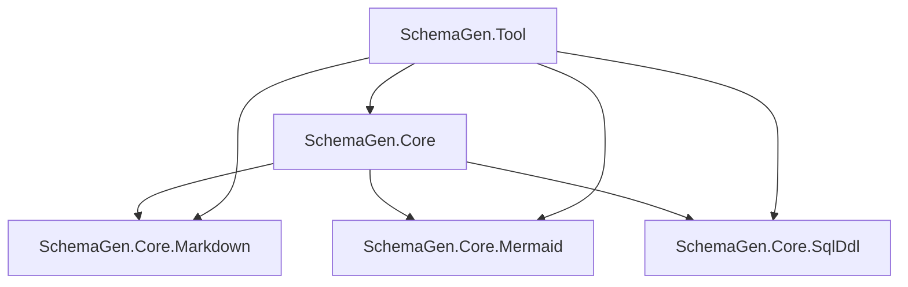
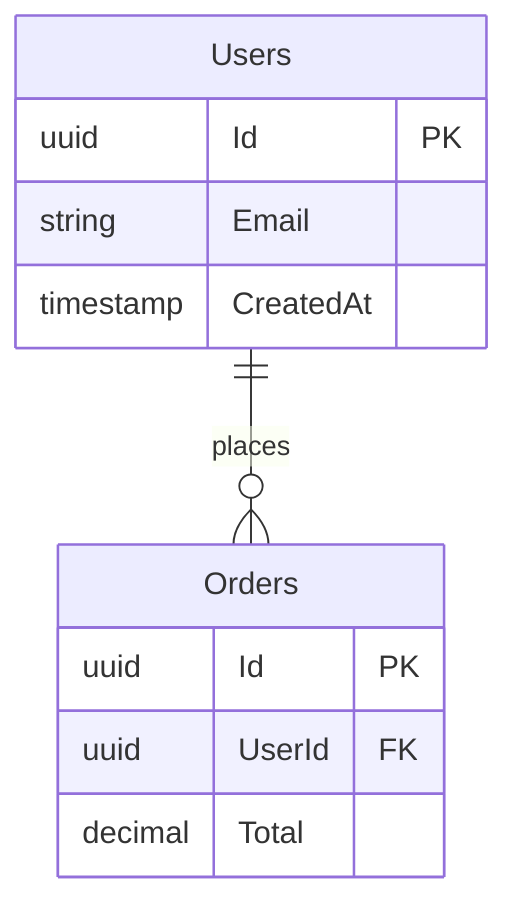

# SchemaGen

[](https://github.com/sslvgr/SchemaGen/actions/workflows/ci.yml)
[](https://opensource.org/licenses/MIT)

A modern .NET library and CLI tool for generating comprehensive documentation and diagrams from Entity Framework database schemas. SchemaGen transforms your Entity Framework models into professional documentation, visual diagrams, and SQL scripts with minimal configuration.

## 🚀 Features

- **📝 Markdown Documentation** - Generate comprehensive database schema documentation with tables, columns, relationships, and constraints
- **📊 Mermaid Diagrams** - Create beautiful entity relationship diagrams (ERDs) for database visualization
- **🗃️ SQL DDL Scripts** - Export Data Definition Language scripts for database creation and migration
- **🔧 CLI Tool** - Command-line interface for easy integration into build pipelines and automation
- **📦 Modular Architecture** - Use individual packages or the complete suite based on your needs
- **🎯 Multi-Targeting** - Supports .NET 8, 9, and 10 for maximum compatibility

## 📦 Package Architecture

This repository contains five NuGet packages organized for maximum flexibility:

### Core Packages

- **`SchemaGen.Core`** - Meta-package containing all core functionality (recommended for most users)
- **`SchemaGen.Core.Markdown`** - Markdown documentation generation functionality
- **`SchemaGen.Core.Mermaid`** - Mermaid diagram generation functionality  
- **`SchemaGen.Core.SqlDdl`** - SQL DDL script generation functionality

### Tool Package

- **`SchemaGen.Tool`** - Command-line interface tool for schema generation



## 📥 Installation

### GitHub Packages (Private Registry)

SchemaGen packages are published to GitHub Packages. To install from GitHub Packages, you need to configure your NuGet sources:

#### 1. Configure Package Source

Add the GitHub Packages source to your `NuGet.config`:

```xml
<?xml version="1.0" encoding="utf-8"?>
<configuration>
  <packageSources>
    <add key="nuget.org" value="https://api.nuget.org/v3/index.json" />
    <add key="github" value="https://nuget.pkg.github.com/sslvgr/index.json" />
  </packageSources>
  <packageSourceCredentials>
    <github>
      <add key="Username" value="YOUR_GITHUB_USERNAME" />
      <add key="ClearTextPassword" value="YOUR_GITHUB_TOKEN" />
    </github>
  </packageSourceCredentials>
</configuration>
```

#### 2. Install Packages

**CLI Tool (Global Installation):**
```bash
dotnet tool install --global SchemaGen.Tool --add-source https://nuget.pkg.github.com/sslvgr/index.json
```

**Library Packages:**
```xml
<!-- Complete functionality (recommended) -->
<PackageReference Include="SchemaGen.Core" Version="1.0.0" />

<!-- Individual packages for specific needs -->
<PackageReference Include="SchemaGen.Core.Markdown" Version="1.0.0" />
<PackageReference Include="SchemaGen.Core.Mermaid" Version="1.0.0" />
<PackageReference Include="SchemaGen.Core.SqlDdl" Version="1.0.0" />
```

**Using .NET CLI:**
```bash
dotnet add package SchemaGen.Core --source https://nuget.pkg.github.com/sslvgr/index.json
```

## 🏃‍♂️ Quick Start

### Prerequisites

Before using SchemaGen, ensure your project has:
- **Design-time DbContext factories** implementing `IDesignTimeDbContextFactory<TContext>`
- **Entity Framework Core 8.0+** configured in your project

### Command Line Usage

The CLI tool provides the most straightforward way to generate schema documentation:

```bash
# Generate all outputs for all DbContexts
schemagen --project MyProject.csproj --output ./docs

# Generate for a specific DbContext
schemagen --assembly MyProject.dll --context MyDbContext --output ./docs

# List available contexts
schemagen --project MyProject.csproj --list-contexts

# Build and generate from project file
schemagen --project MyProject.csproj --configuration Release --tfm net8.0 --context MyDbContext
```

**CLI Options:**
- `--assembly <path>` - Path to compiled assembly (.dll)
- `--project <path>` - Path to project file (.csproj) - will build automatically
- `--context <name|all>` - Specific DbContext name or "all" for all contexts
- `--output <dir>` - Output directory (default: `docs/database`)
- `--configuration <Debug|Release>` - Build configuration when using --project
- `--tfm <framework>` - Target framework when using --project (default: net8.0)
- `--list-contexts` - List all available DbContexts
- `--debug` - Show discovery diagnostics

### Library Usage

For programmatic access, use the individual generator classes:

```csharp
using Microsoft.EntityFrameworkCore;
using SchemaGen.Core.Markdown.SchemaGen;
using SchemaGen.Core.Mermaid.SchemaGen;

// Your DbContext
using var context = new MyDbContext();

// Generate Markdown documentation
var markdown = MarkdownSchemaGenerator.Generate(context);
File.WriteAllText("schema.md", markdown);

// Generate Mermaid ERD
var mermaid = MermaidErdGenerator.Generate(context);
File.WriteAllText("schema.mmd", mermaid);

// Both generators work with any DbContext
Console.WriteLine("Documentation generated successfully!");
```

### Design-Time Factory Setup

SchemaGen requires design-time factories (same pattern as EF migrations):

```csharp
using Microsoft.EntityFrameworkCore;
using Microsoft.EntityFrameworkCore.Design;

public class MyDbContextFactory : IDesignTimeDbContextFactory<MyDbContext>
{
    public MyDbContext CreateDbContext(string[] args)
    {
        var optionsBuilder = new DbContextOptionsBuilder<MyDbContext>();
        optionsBuilder.UseNpgsql("Host=localhost;Database=mydb;Username=user;Password=pass");
        
        return new MyDbContext(optionsBuilder.Options);
    }
}
```

## 📋 Output Examples

### Markdown Documentation

SchemaGen generates comprehensive Markdown documentation including:

- **Database overview** with statistics and table of contents
- **Detailed table documentation** with columns, types, constraints
- **Relationship mapping** showing foreign keys and navigation properties
- **Index information** including unique constraints and filters
- **Primary key definitions** for each table

Example output structure:
```markdown
# Database Schema

**Generated:** 2024-01-15 10:30:00 UTC
**DbContext:** `MyDbContext`

## Statistics
- **Total Tables:** 15
- **Total Foreign Keys:** 23
- **Total Indexes:** 31

## Tables

### Users
**Schema:** `public`
**CLR Type:** `User`

#### Columns
| Column | Type | Nullable | Default | Description |
|--------|------|----------|---------|-------------|
| `Id` | `uuid` | No | `gen_random_uuid()` | PK |
| `Email` | `character varying(255)` | No | `` | |
| `CreatedAt` | `timestamp with time zone` | No | `now()` | OnAdd |
```

### Mermaid ERD

Generates clean entity relationship diagrams:



## 🛠️ Building from Source

### Prerequisites

- **.NET 8 SDK** or later
- **Git** for version control

### Build Steps

```bash
# Clone the repository
git clone https://github.com/sslvgr/SchemaGen.git
cd SchemaGen

# Restore dependencies
dotnet restore

# Build all projects
dotnet build --configuration Release

# Run tests
dotnet test

# Create packages
dotnet pack --configuration Release --output ./artifacts/packages
```

### Project Structure

```
SchemaGen/
├── src/                          # Source projects
│   ├── SchemaGen.Core/           # Meta-package (no code)
│   ├── SchemaGen.Core.Markdown/  # Markdown generation
│   ├── SchemaGen.Core.Mermaid/   # Mermaid diagram generation
│   ├── SchemaGen.Core.SqlDdl/    # SQL DDL generation
│   └── SchemaGen.Tool/           # CLI tool
├── tests/                        # Test projects
├── docs/                         # Documentation
├── .github/workflows/            # CI/CD pipelines
├── Directory.Build.props         # Centralized build properties
├── Directory.Packages.props      # Central package management
└── README.md                     # This file
```

## 🔧 Configuration

### Multi-Targeting Support

All packages support multiple .NET versions:
- **.NET 8.0** - Long-term support
- **.NET 9.0** - Current release
- **.NET 10.0** - Preview/future support

### Version Management

SchemaGen uses **MinVer** for Git-based semantic versioning:
- Versions are automatically calculated from Git tags
- Follows semantic versioning (SemVer) format
- All packages maintain version consistency

### Build Quality Features

- **Deterministic builds** for reproducible outputs
- **Symbol packages** (.snupkg) for enhanced debugging
- **SourceLink integration** for source code navigation
- **Package validation** using Microsoft tools
- **Multi-OS CI/CD** (Ubuntu, Windows, macOS)

## 🤝 Contributing

We welcome contributions! Here's how to get started:

### Development Workflow

1. **Fork** the repository
2. **Create** a feature branch: `git checkout -b feature/amazing-feature`
3. **Make** your changes following the coding standards
4. **Add** tests for new functionality
5. **Run** tests: `dotnet test`
6. **Commit** your changes: `git commit -m 'Add amazing feature'`
7. **Push** to your branch: `git push origin feature/amazing-feature`
8. **Open** a Pull Request

### Coding Standards

- Follow **.NET coding conventions**
- Use **nullable reference types**
- Add **XML documentation** for public APIs
- Maintain **high test coverage**
- Follow **semantic versioning** for breaking changes

### Testing

- **Unit tests** for all new functionality
- **Integration tests** for CLI tool
- **Property-based tests** for core logic validation
- All tests must pass before merging

## 📊 CI/CD Pipeline

SchemaGen uses GitHub Actions for automated building, testing, and publishing:

### Continuous Integration
- **Multi-OS testing** (Ubuntu, Windows, macOS)
- **Multi-.NET testing** (.NET 8, 9, 10)
- **Automated testing** with coverage reporting
- **Package validation** using Microsoft tools
- **Security scanning** for vulnerabilities

### Package Publishing
- **Automated publishing** to GitHub Packages on releases
- **Symbol packages** for debugging support
- **Release artifacts** attached to GitHub releases
- **Semantic versioning** with Git-based version calculation

## 📄 License

This project is licensed under the **MIT License** - see the [LICENSE](LICENSE) file for details.

## 🆘 Support

### Getting Help

- **📖 Documentation** - Check this README and inline code documentation
- **🐛 Issues** - [Open an issue](https://github.com/sslvgr/SchemaGen/issues) for bugs or feature requests
- **💬 Discussions** - Use GitHub Discussions for questions and community support

### Common Issues

**Q: "No design-time DbContext factories found"**
A: Ensure your project has classes implementing `IDesignTimeDbContextFactory<TContext>` (same pattern as EF migrations).

**Q: "Package not found in GitHub Packages"**
A: Verify your GitHub token has `read:packages` permission and your NuGet.config is properly configured.

**Q: "Build fails with multi-targeting"**
A: Ensure all dependencies support your target frameworks (.NET 8, 9, 10).

### Requirements

- **.NET 8.0** or later
- **Entity Framework Core 8.0** or later
- **Design-time DbContext factories** for CLI tool usage

---

**Made with ❤️ by [sslvgr](https://github.com/sslvgr)**
