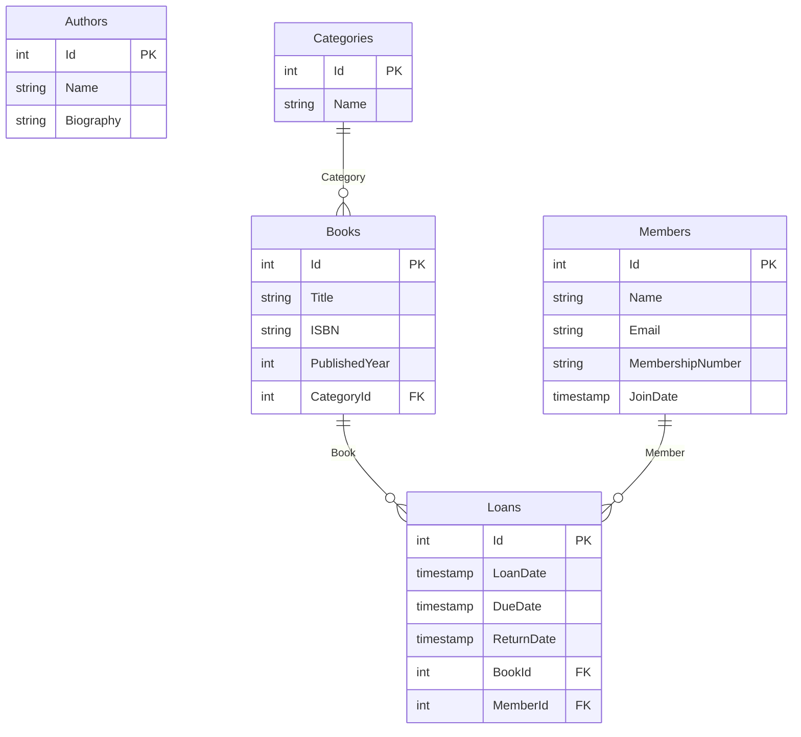

# Basic Mermaid Example

This example demonstrates how to use `SchemaGen.Core.Mermaid` to generate Mermaid ERD (Entity Relationship Diagram) from an Entity Framework DbContext.

## What This Example Shows

- How to reference the `SchemaGen.Core.Mermaid` package
- How to create an Entity Framework DbContext with complex relationships
- How to use `MermaidErdGenerator.Generate()` to create ERD diagrams
- Sample output showing entities, attributes, and relationships in Mermaid format

## Domain Model

The example uses a library management system with five entities:
- **Book** - Represents books with title, ISBN, and publication year
- **Author** - Represents book authors with name and biography
- **Category** - Represents book categories (Fiction, Non-fiction, etc.)
- **Member** - Represents library members with membership details
- **Loan** - Represents book loans with dates and return status

## Key Features Demonstrated

- **Entity Definitions**: All entities with their attributes and data types
- **Relationship Mapping**: Various relationship types (one-to-many, many-to-many)
- **Primary/Foreign Keys**: Automatic detection and labeling of keys
- **Cardinality Notation**: Proper Mermaid ERD relationship symbols

## Running the Example

```bash
cd BasicMermaidExample
dotnet restore
dotnet build
dotnet run
```

## Expected Output

The example will generate an `erd-diagram.md` file in the `output/` directory containing a Mermaid ERD diagram.

## Sample Generated Diagram



*Generated: 2024-01-15 10:30:00 UTC*

## Viewing the Diagram

You can view the generated Mermaid diagram in several ways:

1. **GitHub/GitLab**: Paste the content into a markdown file in your repository
2. **VS Code**: Use the Mermaid Preview extension
3. **Online Viewer**: Visit [mermaid.live](https://mermaid.live/) and paste the content
4. **Documentation Sites**: Most modern documentation platforms support Mermaid

## Relationship Types

The generator automatically detects and represents different relationship types:

- `||--o{` - One-to-many (required parent)
- `||--||` - One-to-one (required both sides)
- `||--o|` - One-to-one (optional child)

## Package Reference

This example uses a project reference to the local SchemaGen.Core.Mermaid project. In a real application, you would reference the NuGet package:

```xml
<PackageReference Include="SchemaGen.Core.Mermaid" Version="1.0.0" />
```