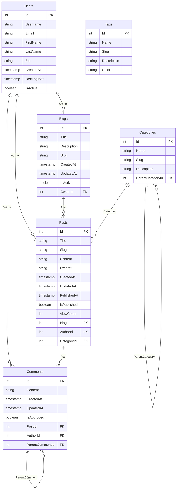

# Complete Blogging Platform Example

This example demonstrates using all SchemaGen packages together to generate comprehensive database documentation for a blogging platform. It showcases the power of combining Markdown documentation, Mermaid diagrams, and SQL DDL scripts.

## What This Example Shows

- **Integrated Usage**: How to use all SchemaGen packages in a single application
- **Complex Domain Model**: A realistic blogging platform with multiple entities and relationships
- **Complete Documentation**: Generated documentation that includes all aspects of the schema
- **Professional Output**: Production-ready documentation suitable for development teams

## Domain Model

The blogging platform includes six main entities with complex relationships:

- **User** - Platform users (authors, commenters)
- **Blog** - Individual blogs owned by users
- **Post** - Blog posts with content, metadata, and publishing status
- **Comment** - Hierarchical comments on posts (with replies)
- **Tag** - Content tags with many-to-many relationship to posts
- **Category** - Hierarchical categories for organizing posts

## Key Features Demonstrated

### Relationship Types
- **One-to-Many**: User → Blogs, Blog → Posts, Post → Comments
- **Many-to-Many**: Posts ↔ Tags (with join table)
- **Self-Referencing**: Comments → ParentComment, Categories → ParentCategory
- **Optional Relationships**: Post → Category (nullable foreign key)

### Advanced Entity Framework Features
- **Unique Indexes**: Username, email, slugs
- **Composite Indexes**: Blog + Slug for posts
- **Default Values**: CreatedAt timestamps using SQL functions
- **Cascade Behaviors**: Different delete behaviors for different relationships
- **Join Tables**: Explicit configuration for many-to-many relationships

### Generated Documentation Types
- **Markdown**: Detailed table documentation with all metadata
- **Mermaid**: Visual ERD showing entity relationships
- **SQL DDL**: Complete database creation script
- **Combined**: Professional documentation combining all formats

## Running the Example

```bash
cd BloggingExample
dotnet restore
dotnet build
dotnet run
```

## Generated Output

The example generates four files in the `output/` directory:

### 1. `schema-documentation.md`
Comprehensive Markdown documentation including:
- Database statistics and overview
- Table of contents with navigation links
- Detailed table documentation with columns, constraints, and relationships
- Index and foreign key information

### 2. `erd-diagram.md`
Mermaid ERD diagram showing:
- All entities with their attributes
- Relationship cardinalities
- Primary and foreign key indicators
- Clean visual representation of the data model

### 3. `database-schema.sql`
Complete SQL DDL script containing:
- CREATE TABLE statements for all entities
- Primary key and foreign key constraints
- Unique and composite indexes
- Proper SQL Server data types and constraints

### 4. `complete-documentation.md`
Combined documentation that includes:
- Executive overview of the system
- Embedded Mermaid diagram
- Complete table documentation
- SQL creation script
- Professional formatting suitable for project documentation

## Sample Output Preview

### Mermaid ERD Diagram


### SQL DDL Sample
```sql
CREATE TABLE [Users] (
    [Id] int NOT NULL IDENTITY,
    [Username] nvarchar(50) NOT NULL,
    [Email] nvarchar(255) NOT NULL,
    [FirstName] nvarchar(100) NOT NULL,
    [LastName] nvarchar(100) NOT NULL,
    [Bio] nvarchar(1000) NULL,
    [CreatedAt] datetime2 NOT NULL DEFAULT (GETUTCDATE()),
    [LastLoginAt] datetime2 NULL,
    [IsActive] bit NOT NULL,
    CONSTRAINT [PK_Users] PRIMARY KEY ([Id])
);

CREATE UNIQUE INDEX [IX_Users_Username] ON [Users] ([Username]);
CREATE UNIQUE INDEX [IX_Users_Email] ON [Users] ([Email]);
```

## Use Cases

This example is perfect for:

- **Development Teams**: Complete schema documentation for new team members
- **Database Administrators**: Understanding the data model and relationships
- **API Documentation**: Including schema information in API docs
- **Code Reviews**: Visualizing the impact of schema changes
- **Project Documentation**: Professional documentation for stakeholders

## Package References

This example uses the meta-package which includes all functionality:

```xml
<ProjectReference Include="../../../src/SchemaGen.Core/SchemaGen.Core.csproj" />
```

In a real application, you would reference the NuGet package:

```xml
<PackageReference Include="SchemaGen.Core" Version="1.0.0" />
```

## Next Steps

After running this example:

1. **Review the generated files** to understand the different documentation formats
2. **Customize the output** by modifying the combined documentation template
3. **Integrate into CI/CD** to automatically generate documentation on schema changes
4. **Share with your team** to establish documentation standards
5. **Adapt the domain model** to match your own application's needs