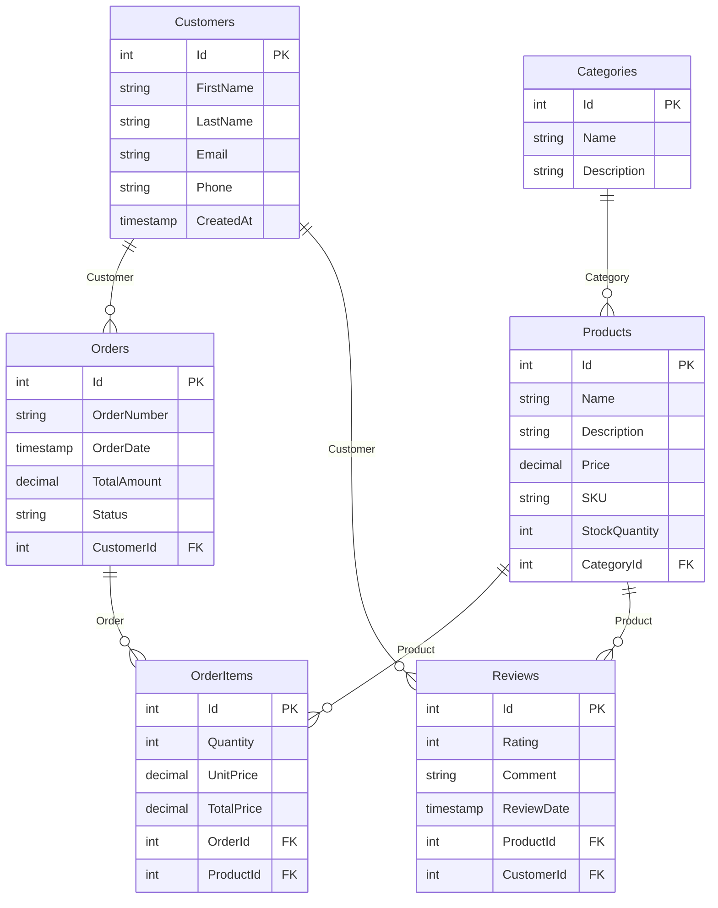

# E-Commerce Example

This example demonstrates using individual SchemaGen packages to generate comprehensive database documentation for an e-commerce system. It shows how to use each package separately while creating a complete documentation suite.

## What This Example Shows

- **Individual Package Usage**: How to use each SchemaGen package independently
- **E-Commerce Domain**: A realistic e-commerce system with products, orders, and reviews
- **Multiple Output Formats**: Generating Markdown, Mermaid, and SQL DDL documentation
- **Professional Workflow**: A complete documentation generation process

## Domain Model

The e-commerce system includes six main entities:

- **Customer** - Platform customers with contact information
- **Category** - Product categories for organization
- **Product** - Products with pricing, inventory, and descriptions
- **Order** - Customer orders with status tracking
- **OrderItem** - Individual items within orders (line items)
- **Review** - Customer product reviews with ratings

## Key Features Demonstrated

### Entity Relationships
- **One-to-Many**: Customer → Orders, Category → Products, Order → OrderItems
- **Many-to-One**: Product → Category, OrderItem → Product/Order
- **Customer Reviews**: Customers can review products they've purchased

### Database Design Patterns
- **Unique Constraints**: Email addresses, SKUs, order numbers
- **Decimal Precision**: Proper decimal handling for prices and totals
- **Status Tracking**: Order status management
- **Audit Fields**: Creation timestamps and review dates

### Generated Documentation
- **Markdown**: Complete table documentation with relationships
- **Mermaid**: Visual ERD showing the data model structure
- **SQL DDL**: Database creation script for SQL Server

## Running the Example

```bash
cd ECommerceExample
dotnet restore
dotnet build
dotnet run
```

## Generated Output

The example generates three files in the `output/` directory:

### 1. `README.md`
Comprehensive Markdown documentation including:
- Database overview and statistics
- Detailed table documentation with columns and constraints
- Foreign key relationships and indexes
- Navigation properties

### 2. `erd.md`
Mermaid ERD diagram showing:
- All entities with their attributes
- Relationship cardinalities and constraints
- Primary and foreign key indicators
- Clean visual representation

### 3. `schema.sql`
Complete SQL DDL script containing:
- CREATE TABLE statements for all entities
- Primary key and foreign key constraints
- Unique indexes for business keys
- Proper SQL Server data types

## Sample Generated Content

### Mermaid ERD Preview


### SQL DDL Sample
```sql
CREATE TABLE [Customers] (
    [Id] int NOT NULL IDENTITY,
    [FirstName] nvarchar(100) NOT NULL,
    [LastName] nvarchar(100) NOT NULL,
    [Email] nvarchar(255) NOT NULL,
    [Phone] nvarchar(20) NULL,
    [CreatedAt] datetime2 NOT NULL,
    CONSTRAINT [PK_Customers] PRIMARY KEY ([Id])
);

CREATE TABLE [Products] (
    [Id] int NOT NULL IDENTITY,
    [Name] nvarchar(200) NOT NULL,
    [Description] nvarchar(1000) NULL,
    [Price] decimal(18,2) NOT NULL,
    [SKU] nvarchar(50) NOT NULL,
    [StockQuantity] int NOT NULL,
    [CategoryId] int NOT NULL,
    CONSTRAINT [PK_Products] PRIMARY KEY ([Id]),
    CONSTRAINT [FK_Products_Categories_CategoryId] FOREIGN KEY ([CategoryId]) REFERENCES [Categories] ([Id]) ON DELETE NO ACTION
);

CREATE UNIQUE INDEX [IX_Customers_Email] ON [Customers] ([Email]);
CREATE UNIQUE INDEX [IX_Products_SKU] ON [Products] ([SKU]);
```

## Package Usage Patterns

This example demonstrates three different usage patterns:

### 1. Individual Package References
```xml
<ProjectReference Include="../../../src/SchemaGen.Core.Markdown/SchemaGen.Core.Markdown.csproj" />
<ProjectReference Include="../../../src/SchemaGen.Core.Mermaid/SchemaGen.Core.Mermaid.csproj" />
<ProjectReference Include="../../../src/SchemaGen.Core.SqlDdl/SchemaGen.Core.SqlDdl.csproj" />
```

### 2. Direct Generator Usage
```csharp
// Generate each format independently
var markdown = MarkdownSchemaGenerator.Generate(context);
var mermaidDiagram = MermaidErdGenerator.Generate(context);
var sqlDdl = SqlDdlGenerator.Generate(context);
```

### 3. File Output Management
```csharp
// Save to organized output structure
File.WriteAllText(Path.Combine("output", "README.md"), markdown);
File.WriteAllText(Path.Combine("output", "erd.md"), mermaidDiagram);
File.WriteAllText(Path.Combine("output", "schema.sql"), sqlDdl);
```

## Use Cases

This example is ideal for:

- **E-Commerce Projects**: Understanding product, order, and customer relationships
- **Database Design**: Visualizing complex business relationships
- **Team Documentation**: Providing clear schema documentation for developers
- **Code Reviews**: Understanding the impact of schema changes
- **API Development**: Having clear data model documentation

## Comparison with Meta-Package

This example uses individual packages instead of the meta-package (`SchemaGen.Core`). This approach is useful when:

- You only need specific functionality (e.g., just Markdown generation)
- You want to minimize dependencies
- You need fine-grained control over package versions
- You're building custom documentation workflows

For most use cases, the meta-package (`SchemaGen.Core`) is recommended as it provides all functionality in a single reference.

## Next Steps

After running this example:

1. **Examine the generated files** to understand each documentation format
2. **Customize the domain model** to match your own e-commerce requirements
3. **Integrate into your build process** for automated documentation generation
4. **Compare with the meta-package approach** in the BloggingExample
5. **Explore the CLI tool** in the ToolUsageExample for automated workflows